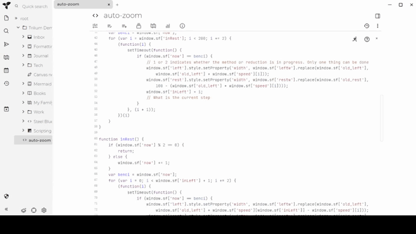

When the tree on the left panel has a lot of long titles, it is not convenient to view. 
This script can automatically increase the width of the left panel when the mouse moves to the left.
## Version: 0.1
## Installation
Create a code note of type JS Frontend with the contents of trilium-left-panel-auto-zoom.js and the label #widget
## Features
 Three modes are supported :
 1. Automatically zoom in on the left panel when the mouse moves to the navigation bar. This is the default mode.
 2. Automatically zoom in on the left panel when the mouse moves to the left panel.
 3. Automatically zoom in on the left panel when the shortcut key `alt+s` is pressed. 
## Preview
